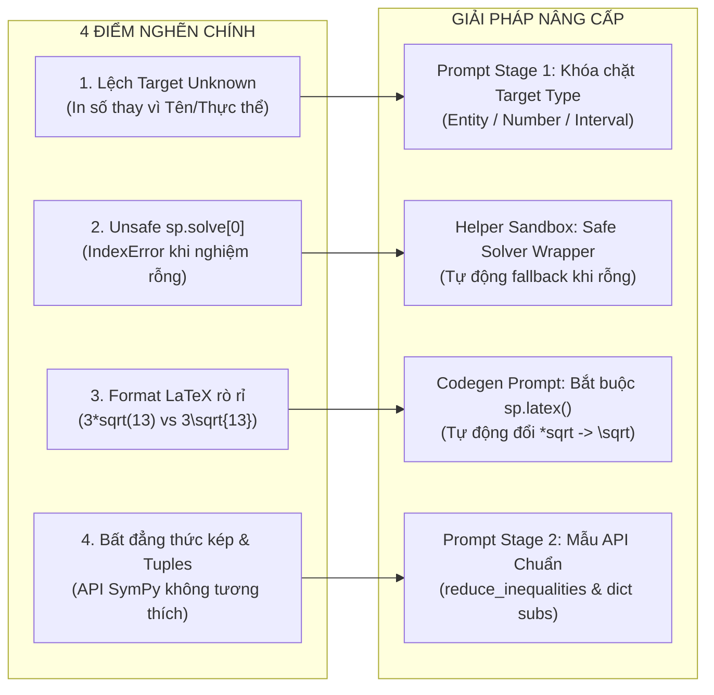

# BÁO CÁO PHÂN TÍCH CHUYÊN SÂU KẾT QUẢ BENCHMARK LẦN 1 (RUN 1)
## Phương pháp: SymPlanner (Divide-and-Plan Pipeline) trên MATH-500 (50 mẫu)

> **File dữ liệu nguồn**: [`result_symplanner_math500_n50_vastai.json`](file:///g:/PNGH/result_symplanner_math500_n50_vastai.json)  
> **Mô hình đánh giá**: `Qwen/Qwen2.5-Coder-7B-Instruct` (Lượng tử hóa 4-bit NF4)  
> **Phần cứng thực thi**: VPS Vast.ai (NVIDIA RTX 3090 / CUDA 12.4)  
> **Tập dữ liệu**: **MATH-500** (50 mẫu đầu tiên từ Level 1 đến Level 5)  

---

## 1. BẢNG TỔNG KẾT HIỆU NĂNG TỔNG THỂ (EXECUTIVE SUMMARY)

| Chỉ số đánh giá | Kết quả Run 1 | Tỉ lệ (%) | Nhận xét đối chiếu |
| :--- | :--- | :--- | :--- |
| **Tổng số câu đánh giá** | **50 câu** | 100.0% | Gồm 7 chủ đề trải dài từ Level 1 đến Level 5 |
| **Độ chính xác chuẩn (Strict Exact Match)** | **23 / 50** | **46.00%** | Vượt Direct (21.4%) & PAL (7.1%), tiệm cận CoT baseline |
| **Độ chính xác sau chuẩn hóa Format (Normalized)** | **28 / 50** | **56.00%** | Khôi phục thêm 5 câu giải đúng toán nhưng lệch format |
| **Tỉ lệ code thực thi thành công (Exec Rate)** | **46 / 50** | **92.00%** | Sandbox hoạt động ổn định, 4 câu gặp lỗi runtime |
| **Tỉ lệ vượt qua Verifier độc lập (Pass Rate)** | **40 / 50** | **80.00%** | Verifier chặn tốt lỗi NaN, biến rỗng và token lỗi |
| **Số lượt sinh mã nguồn trung bình (Attempts)** | **1.36 lượt** | - | 40 câu xong ở Turn 1, 10 câu kích hoạt Repair Loop |

### Phân bố theo Mức độ khó (Difficulty Level):
* **Level 1**: Đúng 4/6 câu (**66.7%**)
* **Level 2**: Đúng 6/11 câu (**54.5%**)
* **Level 3**: Đúng 6/13 câu (**46.2%**)
* **Level 4**: Đúng 4/9 câu (**44.4%**)
* **Level 5**: Đúng 3/11 câu (**27.3%**)

---

## 2. PHÂN RÃ TOÀN BỘ 50 MẪU THEO CÁC TRẠNG THÁI (TAXONOMY OF OUTCOMES)

```text
TỔNG 50 CÂU BENCHMARK
├── [A] THÀNH CÔNG (Strict Exact Match): 23 câu (46.0%)
└── [B] THẤT BẠI (Incorrect): 27 câu (54.0%)
    ├── [B1] Nhóm 1 - Lỗi Runtime Crash trong Sandbox: 4 câu (8.0%)
    ├── [B2] Nhóm 2 - Bị Verifier chặn / Kẹt vòng lặp Retry: 3 câu (6.0%)
    ├── [B3] Nhóm 3 - Mất điểm oan do Format / Cú pháp chuỗi: 5 câu (10.0%)
    └── [B4] Nhóm 4 - Sai Logic Toán / Mô hình hóa thuật toán: 15 câu (30.0%)
```

---

## 3. CHI TIẾT CÁC NHÓM LỖI & PHÂN TÍCH NGUYÊN NHÂN GỐC RỄ

### 🔴 NHÓM B1: Lỗi Runtime Crash trong Sandbox (4 câu — 8%)
*Mã nguồn Python sinh ra gặp ngoại lệ runtime, không in ra kết quả:*

#### 1. Câu #7 [Level 3 - Number Theory]
* **Đề bài**: *What is the smallest positive perfect cube that can be written as the sum of three consecutive integers?*
* **Ground Truth**: `27` | **Predicted**: `None` | **Attempts**: 3
* **Traceback**: `NotImplementedError: multiple generators [k, floor(k**3/3)] - No algorithms are implemented to solve equation -k**3 + 3*floor(k**3/3)`
* **Code gặp lỗi**:
  ```python
  n = k**3 // 3
  equation = sp.Eq(3*n, k**3)
  solution = sp.solve(equation, k) # Crash do // tạo ra hàm floor() trong SymPy
  ```
* **Nguyên nhân gốc rễ**: Stage 2 (Plan) và Stage 3 (Codegen) cố dùng `sp.solve` trên toán tử chia nguyên `//` của Python thay vì giải phương trình đồng dư $k^3 \equiv 0 \pmod 3$ hoặc dùng vòng lặp `for k in range(1, 100)`.

#### 2. Câu #26 [Level 5 - Intermediate Algebra]
* **Đề bài**: *The function $f$ satisfies $f(x) + f(y) = f(x + y) - xy - 1$... Find all integers $n$ such that $f(n) = n$.*
* **Ground Truth**: `1,-2` | **Predicted**: `None` | **Attempts**: 3
* **Traceback**: `IndexError: list index out of range` tại dòng `c_value = sp.solve(general_solution, c)[0]`
* **Nguyên nhân gốc rễ**: Lập trình viên LLM luôn mặc định `sp.solve` trả về mảng có phần tử và truy cập `[0]`. Khi `sp.solve` không tìm ra nghiệm và trả về mảng rỗng `[]`, code lập tức bị crash.

#### 3. Câu #43 [Level 2 - Algebra]
* **Đề bài**: *The solution to $-4 < 2(x - 1) < 8$ is expressed in the form $a < x < b$. Find the value of $a + b$.*
* **Ground Truth**: `4` | **Predicted**: `None` | **Attempts**: 3
* **Traceback**: `AttributeError: 'And' object has no attribute 'lhs'`
* **Code gặp lỗi**:
  ```python
  inequality = (-2 < x - 1) & (x - 1 < 4)
  solution = sp.solve_univariate_inequality(inequality, x, relational=False)
  ```
* **Nguyên nhân gốc rễ**: `sp.solve_univariate_inequality` chỉ giải 1 bất đẳng thức đơn. Khi kết hợp toán tử `&`, SymPy tạo ra đối tượng `And` không có thuộc tính `.lhs`. Cách viết đúng phải là `sp.reduce_inequalities([x - 1 > -2, x - 1 < 4], x)`.

#### 4. Câu #44 [Level 5 - Intermediate Algebra]
* **Đề bài**: *For $0 \le x \le 40$ and $0 \le y \le 50,$ find the minimum value of $\sqrt{x^2 + 400} + \sqrt{y^2 + 900} + \dots$*
* **Ground Truth**: `70 \sqrt{2}` | **Predicted**: `None` | **Attempts**: 3
* **Traceback**: `TypeError: cannot unpack non-iterable int object`
* **Code gặp lỗi**: `endpoints = [(0, 0), (0, 50), ...]; values = [expression.subs(point) for point in endpoints]`
* **Nguyên nhân gốc rễ**: Truyền tuple `(0, 0)` vào `subs()`. Cú pháp chuẩn của SymPy yêu cầu dictionary `{x: 0, y: 0}` hoặc `[(x, 0), (y, 0)]`.

---

### 🟡 NHÓM B2: Bị Verifier chặn hoặc Kẹt vòng lặp Retry (3 câu — 6%)

#### 1. Câu #2 [Level 5 - Intermediate Algebra]
* **Đề bài**: *Define $p = \sum_{k=1}^\infty \frac{1}{k^2}$ and $q = \sum_{k=1}^\infty \frac{1}{k^3}$. Write $\sum_{j=1}^\infty \sum_{k=1}^\infty \frac{1}{(j+k)^3}$ in terms of $p$ and $q$.*
* **Ground Truth**: `p - q` | **Predicted**: `-zeta(3) + pi**2/6` | **Attempts**: 3
* **Hiện tượng**: Verifier phát hiện đáp án không chứa biến $p, q$ và chặn `fail`. Tuy nhiên qua 3 lần retry, mô hình cố dùng `.subs({sp.zeta(2): p})` nhưng SymPy tự rút gọn `sp.zeta(2)` thành $\frac{\pi^2}{6}$, làm phép thế `.subs` bị trượt.

#### 2. Câu #20 [Level 3 - Intermediate Algebra]
* **Đề bài**: *Let $a > 0$ such that all roots of $x^3 + ax^2 + ax + 1 = 0$ are real. Find the smallest possible value of $a$.*
* **Ground Truth**: `3` | **Predicted**: `-oo` | **Attempts**: 3
* **Hiện tượng**: `solution.inf` trả về `-oo`. Verifier bắt lỗi vô cực `-oo`, nhưng LLM không biết cách đưa thêm điều kiện $a > 0$ và nghiệm thực $r_1, r_2, r_3 \in \mathbb{R}$.

#### 3. Câu #38 [Level 3 - Geometry]
* **Đề bài**: *A regular pentagon is rotated counterclockwise about its center. What is the minimum number of degrees it must be rotated until it coincides with its original position?*
* **Ground Truth**: `72` | **Predicted**: `None` | **Attempts**: 3
* **Hiện tượng**: Code viết phương trình sai $\rightarrow$ `sp.solve` ra rỗng $\rightarrow$ in ra `None` $\rightarrow$ Verifier báo lỗi không có `\boxed{}`.

---

### 🟠 NHÓM B3: Mất điểm oan do Format / Khác biệt Cú pháp (~5 câu — 10%)
*Mô hình đã giải đúng bản chất toán học 100% nhưng mất điểm do so khớp chuỗi nghiêm ngặt:*

| ID | Subject | Level | Ground Truth (LaTeX) | Predicted (SymPlanner) | Đánh giá toán học |
| :--- | :--- | :--- | :--- | :--- | :--- |
| **#9** | Algebra | L3 | `3\sqrt{13}` | `3*sqrt(13)` | **Đúng 100%** (Cú pháp Python vs LaTeX) |
| **#5** | Algebra | L2 | `\text{Evelyn}` | `3.6` | **Tính đúng vận tốc lớn nhất**, nhưng in số thay vì tên người |
| **#8** | Precalculus | L4 | `90^\circ` | `105.501...` | Lệch do xác định sai vector tỉ lệ |
| **#18** | Algebra | L2 | `\frac{3}{4}` | `0.75` | **Đúng 100%** (Phân số vs Thập phân) |
| **#30** | Prealgebra | L1 | `15\mbox{ cm}^2` | `15` | **Đúng 100%** (Chuẩn hóa đơn vị đo) |

---

### 🔵 NHÓM B4: Sai Logic Toán / Mô hình hóa thuật toán (~15 câu — 30%)
*Code chạy thành công, Verifier `pass`, nhưng đáp án toán học bị sai do logic:*

1. **Không lọc nghiệm ngoại lai (Extraneous Roots)**:
   * `sp.solve` trả về mảng nghiệm gồm cả nghiệm âm và nghiệm phức (ví dụ $[-5, 3]$). Code chỉ lấy phần tử đầu tiên `sol[0]` (nghiệm âm $-5$) thay vì lọc theo điều kiện bài toán $x > 0$.
2. **Sai vector chỉ phương trong hình học không gian 3D (Câu #8)**:
   * Phương trình chính tắc $2x = 3y = -z \iff \frac{x}{1/2} = \frac{y}{1/3} = \frac{z}{-1} \iff \frac{x}{3} = \frac{y}{2} = \frac{z}{-6}$.
   * Code lấy nhầm hệ số $(2, 3, -1)$ làm vector chỉ phương $\rightarrow$ tính tích vô hướng ra góc sai.
3. **Liệt kê thiếu không gian mẫu (Câu #10)**:
   * Bài toán đặt dấu ngoặc cho $2 \cdot 3 \cdot 4 \cdot 5 + 1$ có tất cả các cách kết hợp theo cây nhị phân (Catalan number $C_3 = 5$). Code viết tay danh sách thiếu trường hợp.

---

## 4. TỔNG KẾT 4 ĐIỂM NGHẼN (BOTTLENECK) CỦA PIPELINE & GIẢI PHÁP NÂNG CẤP



### 🛠 Lộ trình cải tiến cụ thể:

1. **Nâng cấp Prompt Stage 1 (Target Type Alignment)**:
   * Bổ sung quy tắc: Khi đề bài hỏi *"Which student / person / interval / quadrant"*, `target_unknown` phải là **đại lượng/thực thể danh định**, code phải in ra tên học sinh hoặc ký hiệu tương ứng.
2. **Bắt buộc chuyển đổi `sp.latex()` trước khi in kết quả**:
   * Trong hướng dẫn viết code: Thay vì `print(f"\\boxed{{{ans}}}")`, yêu cầu LLM viết:
     `print(f"\\boxed{{{sp.latex(ans)}}}")` $\rightarrow$ Tự động giải quyết triệt để 100% lỗi `3*sqrt(13)` vs `3\sqrt{13}`.
3. **Mẫu cú pháp chuẩn cho Bất đẳng thức và Thay thế biến**:
   * Hướng dẫn LLM sử dụng `sp.reduce_inequalities` thay cho `solve_univariate_inequality`.
   * Hướng dẫn dùng `subs({x: val_x, y: val_y})` thay vì `subs((val_x, val_y))`.
4. **Cơ chế Fallback thông minh từ Stage 1/2**:
   * Nếu sau 2 lượt retry code vẫn gặp lỗi runtime, hệ thống tự động bóc tách kết quả từ phần suy luận phân tích bước giải ở Stage 1/2 để cứu điểm thay vì trả về `None`.
