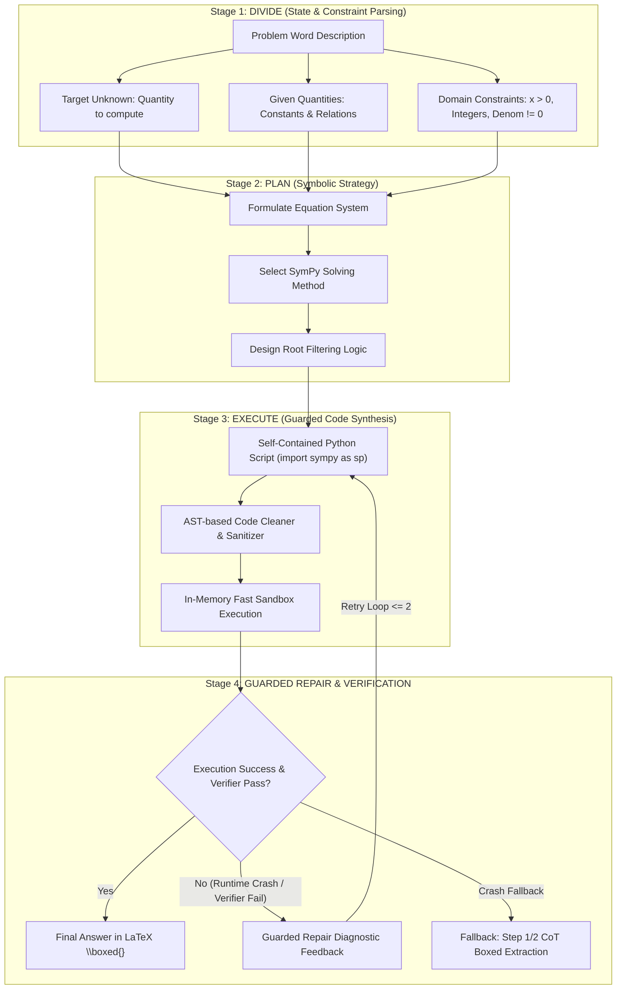

# LLM Reasoning Benchmark Suite: Qwen2.5-Coder-7B-Instruct

Hệ thống benchmark đánh giá năng lực suy luận toán học chuẩn hóa cho mô hình ngôn ngữ lớn Qwen2.5-Coder-7B-Instruct trên các tập dữ liệu benchmark tiêu chuẩn MATH-500 và GSM8K với 6 phương pháp / biến thể thực nghiệm:

1. **Direct**: Zero-shot Direct Answering (dự đoán đáp án trực tiếp).
2. **CoT (Chain-of-Thought)**: Zero-shot Step-by-Step Natural Language Reasoning (suy luận từng bước bằng ngôn ngữ tự nhiên theo Wei et al., NeurIPS 2022).
3. **SymCode**: Neurosymbolic Equation Solving với SymPy (ACL 2026) tích hợp vòng lặp tự sửa lỗi (Self-Debugging Loop) dựa trên Traceback thực thi và Bộ kiểm chứng toán học độc lập (Independent Mathematical Verifier).
4. **SymExtract** *(Ablation 1)*: Single-Stage Neurosymbolic Program Synthesis — Chỉ kích hoạt **Stage 1 (DIVIDE / State Extraction)** để đo lường đóng góp độc lập của việc phân rã mục tiêu và ràng buộc miền xác định.
5. **SymPlan** *(Ablation 2)*: Single-Stage Neurosymbolic Program Synthesis — Chỉ kích hoạt **Stage 2 (PLAN / Algorithmic Strategy)** để đo lường đóng góp độc lập của việc lập kế hoạch đại số biểu tượng.
6. **SymPlanner** *(Full Proposed)*: Divide-and-Plan Neurosymbolic Program Synthesis (Stage 1 Divide -> Stage 2 Plan -> Stage 3 SymCode Execution -> Guarded Repair).

---

## 1. Cấu trúc thư mục dự án

```text
symcode/
├── README.md                   # Tài liệu hướng dẫn tổng quan và thực thi chi tiết
├── kaggle.zip                  # Gói lưu trữ dự án để upload trực tiếp lên Kaggle
├── kaggle/
│   ├── data/                   # Tập dữ liệu benchmark đã được chuẩn hóa
│   │   ├── gsm8k/              # GSM8K (1.320 mẫu test phân loại theo chủ đề và độ khó Level 1-5)
│   │   │   └── test.jsonl
│   │   └── math500/            # MATH-500 (500 mẫu test gồm 7 chủ đề và độ khó Level 1-5)
│   │       └── test.jsonl
│   ├── method/                 # Các module xử lý cốt lõi
│   │   ├── __init__.py         # Package exports cho hệ thống (Direct, CoT, SymCode, SymPlanner)
│   │   ├── prompts.py          # Định nghĩa ChatML prompts và message builders (Direct, CoT, SymCode, SymPlanner)
│   │   ├── extractor.py        # Trích xuất \boxed{}, làm sạch mã nguồn AST (extract_symplanner_code) và so khớp Exact Match
│   │   ├── sandbox.py          # In-Memory Fast Sandbox thực thi code cách ly với bảo vệ timeout
│   │   ├── verifier.py         # Bộ kiểm chứng toán học độc lập (không sử dụng ground truth)
│   │   ├── model.py            # LLMRunner với lượng tử hóa 4-bit (bitsandbytes) và SDPA attention
│   │   └── evaluator.py        # Engine đánh giá benchmark (evaluate_direct_or_cot, evaluate_symcode, evaluate_symplanner)
│   ├── inference.ipynb         # Jupyter Notebook thực thi benchmark trực quan trên Kaggle GPU (hỗ trợ cả 4 phương pháp)
│   ├── run_benchmark.py        # Script thực thi benchmark qua giao diện dòng lệnh (CLI)
│   └── requirements.txt        # Danh sách thư viện phụ thuộc
├── paper/                      # Các tài liệu nghiên cứu tham khảo (CoT, PAL, SymCode)
└── result/                     # Thư mục chứa các kết quả benchmark đã thực hiện
```

---

## 2. Kiến trúc Phương pháp Đề xuất: SymPlanner (Divide-and-Plan Pipeline)

**SymPlanner** (*Divide-and-Plan Neurosymbolic Program Synthesis*) là kiến trúc suy luận toán học 4 giai đoạn được thiết kế nhằm khắc phục triệt để hiện tượng ảo giác, tính nhẩm sai và bỏ sót điều kiện biên của các mô hình LLM cỡ nhỏ (7B):



### Chi tiết các giai đoạn cốt lõi:

1. **Stage 1 — DIVIDE (Phân rã trạng thái & Khóa mục tiêu)**:
   - Chuyển đổi đề bài từ văn bản tự nhiên lộn xộn thành 3 trường dữ liệu tường minh: `Target Unknown` (khóa chặt mục tiêu cần tìm, tránh nhầm lẫn đại lượng), `Given Quantities` (hằng số, mối quan hệ đã cho) và `Domain Constraints` (ràng buộc miền xác định: số dương, nghiệm nguyên, xác suất $[0, 1]$, mẫu số $\neq 0$).
2. **Stage 2 — PLAN (Lập kế hoạch thuật toán biểu tượng)**:
   - Dựa trên dữ liệu từ Stage 1 để vạch ra hệ phương trình đại số, chiến lược áp dụng các hàm của SymPy (`sp.solve`, `sp.simplify`, `sp.summation`), và quy trình lọc nghiệm ngoại lai (*extraneous roots*) mà không thực hiện tính nhẩm vội vàng.
3. **Stage 3 — EXECUTE (Sinh mã nguồn SymPy an toàn)**:
   - Chuyển kế hoạch thành script Python độc lập. Định nghĩa biến với các giả định toán học (`sp.symbols('x', positive=True, real=True)`).
   - Bộ làm sạch **AST-based Sanitizer** tự động bóc tách các tiêu đề Markdown hoặc văn bản rò rỉ từ Stage 1/2, đảm bảo mã nguồn đạt 100% tính hợp lệ cú pháp trước khi nạp vào **In-Memory Fast Sandbox**.
4. **Stage 4 — GUARDED REPAIR & INDEPENDENT VERIFIER (Tự sửa lỗi & Kiểm chứng độc lập)**:
   - Nếu code gặp lỗi runtime hoặc in ra kết quả rỗng, hệ thống tổng hợp Traceback + phản hồi từ **Independent Mathematical Verifier** để LLM sửa lại mã nguồn (tối đa 2 lần).
   - Tích hợp cơ chế **Safe Fallback**: nếu thực thi code không cho ra đáp án hợp lệ, hệ thống tự động bóc tách kết quả từ phần phân tích bước giải ở Stage 1/2 để cứu điểm.

---

## 3. Quy chuẩn thực nghiệm và tính khách quan (Fairness & Protocol)

Hệ thống tuân thủ nghiêm ngặt các quy chuẩn đánh giá benchmark khoa học để đảm bảo tính công bằng giữa các phương pháp:

| Tiêu chí | Quy chuẩn thực nghiệm |
| :--- | :--- |
| Mô hình đánh giá | Qwen/Qwen2.5-Coder-7B-Instruct |
| Lượng tử hóa | 4-bit NormalFloat4 (NF4) qua bitsandbytes, double quantization |
| Kiểu dữ liệu tính toán | bfloat16 (trên GPU hỗ trợ) hoặc float16 |
| Cơ chế chú ý | Scaled Dot-Product Attention (SDPA) tiết kiệm VRAM |
| Chiến lược giải mã | Greedy Search (temperature = 0.0, top_p = 1.0) |
| Giới hạn độ dài sinh | max_new_tokens = 1024 |
| Tập dữ liệu & Thứ tự | Giữ nguyên 100% thứ tự câu hỏi gốc giữa tất cả các phương pháp |
| Công cụ của SymCode | Python chuẩn + SymPy (Symbolic Algebra, Calculus, Number Theory, Geometry) |
| Công cụ của SymPlanner | Divide (State Extraction) -> Plan (Strategy) -> SymCode (Guarded Execution) + AST Sanitizer |
| Bộ kiểm chứng Verifier | Kiểm tra tính nhất quán đại số, miền xác định, không truy cập ground truth |
| Giới hạn thử lại (Retry) | Tối đa 2 lần thử lại (max_retries = 2) cho SymCode và SymPlanner |
| Đánh giá đáp án (Metrics)| Exact Match (EM) trên \boxed{...}, hỗ trợ tương đương đại số qua SymPy |

---

## 3. Hướng dẫn chi tiết cách chạy trên Kaggle

Kaggle cung cấp GPU miễn phí (NVIDIA T4 x2 hoặc P100). Quy trình thực thi trên Kaggle được thiết kế tối giản:

### Bước 1: Chuẩn bị mã nguồn
- Sử dụng file `kaggle.zip` đã đóng gói sẵn trong thư mục gốc của dự án.

### Bước 2: Tạo Dataset trên Kaggle
1. Đăng nhập vào [Kaggle](https://www.kaggle.com/).
2. Vào mục **Datasets** -> Chọn **New Dataset**.
3. Đặt tên dataset (ví dụ: `symcode-benchmark`).
4. Upload file `kaggle.zip` (Kaggle sẽ tự động giải nén) -> Nhấn **Create**.

### Bước 3: Tạo và Cấu hình Notebook trên Kaggle
1. Vào mục **Code** -> Chọn **New Notebook**.
2. Mở menu bên phải (**Notebook options**):
   - **Accelerator**: Chọn **GPU T4 x2** hoặc **GPU P100**.
   - **Internet**: Chọn **Internet On** (bắt buộc để tải weights mô hình từ Hugging Face).
   - **Persistence**: Chọn **Variables and files** (để giữ checkpoint khi cần).
3. Nhấn **Add Input** -> Chọn dataset `symcode-benchmark` vừa tạo ở Bước 2.

### Bước 4: Thực thi Notebook
1. Mở file `kaggle/inference.ipynb` và copy toàn bộ nội dung vào Notebook trên Kaggle (hoặc import trực tiếp file `.ipynb`).
2. Tại **Cell 3 (Bảng điều khiển cấu hình)**, tùy chỉnh các thông số theo nhu cầu:
   - `DATASET_CHOICE`: Chọn `"math500"` hoặc `"gsm8k"`.
   - `METHODS_TO_RUN`: Danh sách phương pháp cần chạy, ví dụ `["Direct", "CoT", "SymCode", "SymPlanner"]`.
   - `NUM_SAMPLES`: Số lượng mẫu đánh giá (đặt `5` để test nhanh, hoặc `None` để chạy toàn bộ tập dữ liệu).
   - `FILTER_LEVELS`: Đặt `[1, 2, 3]` để chỉ đánh giá mức độ mong muốn (hỗ trợ phân loại Level 1-5 cho cả MATH-500 và GSM8K), hoặc `None` để đánh giá tất cả các Level 1-5.
3. Chọn **Run All** (hoặc bấm Shift + Enter từng cell theo thứ tự).

### Bước 5: Theo dõi và Xuất kết quả
- Hệ thống tự động lưu checkpoint trung gian sau mỗi 5 mẫu vào `/kaggle/working/`. Nếu phiên làm việc bị ngắt đột ngột, khi chạy lại hệ thống sẽ tự động tiếp tục (Auto-Resume) từ vị trí dừng trước đó mà không cần chạy lại từ đầu.
- Sau khi chạy xong, kết quả tổng hợp đa chiều sẽ được xuất ra file JSON (ví dụ: `math500_lvl1_3_results.json`) tại mục `/kaggle/working/` để tải về.

---

## 4. Hướng dẫn chi tiết cách chạy trên Máy cục bộ / Server qua CLI

Ngoài giao diện Notebook, hệ thống hỗ trợ script dòng lệnh `run_benchmark.py` để chạy tự động trên server Linux / macOS / Windows.

### Yêu cầu hệ thống
- Python >= 3.10
- GPU NVIDIA hỗ trợ CUDA (VRAM tối thiểu 8GB cho lượng tử hóa 4-bit) hoặc chạy trên CPU (chế độ fallback).

### Cài đặt môi trường

```bash
# 1. Clone hoặc truy cập thư mục dự án
cd symcode

# 2. Tạo môi trường ảo Python
python3 -m venv venv
source venv/bin/activate  # Trên Windows: venv\Scripts\activate

# 3. Cài đặt các thư viện phụ thuộc
pip install -r kaggle/requirements.txt
```

### Các lệnh thực thi mẫu

**1. Chạy test nhanh 5 mẫu trên MATH-500 (Level 1 đến 3) với cả 4 phương pháp:**
```bash
python kaggle/run_benchmark.py --dataset math500 --num-samples 5 --filter-levels 1 2 3 --methods Direct CoT SymCode SymPlanner
```

**2. Chạy toàn bộ tập dữ liệu GSM8K với cả 4 phương pháp:**
```bash
python kaggle/run_benchmark.py --dataset gsm8k --methods Direct CoT SymCode SymPlanner
```

**3. Chạy đánh giá riêng phương pháp SymPlanner (hoặc SymCode) trên MATH-500:**
```bash
python kaggle/run_benchmark.py --dataset math500 --methods SymPlanner --output-file result_symplanner_full.json
```

**4. Danh sách đầy đủ các tham số hỗ trợ:**

| Tham số | Kiểu | Mặc định | Mô tả |
| :--- | :--- | :--- | :--- |
| `--dataset` | str | `math500` | Chọn tập dữ liệu: `math500` hoặc `gsm8k` |
| `--dataset-path` | str | `None` | Đường dẫn tùy biến tới file `.jsonl` |
| `--methods` | list | `Direct CoT SymCode SymPlanner` | Danh sách các phương pháp cần đánh giá |
| `--num-samples` | int | `None` | Giới hạn số mẫu cần đánh giá (`None` = toàn bộ) |
| `--filter-levels` | list | `None` | Lọc theo mức độ khó (ví dụ: `--filter-levels 1 2 3`) |
| `--model-id` | str | `Qwen/Qwen2.5-Coder-7B-Instruct` | ID mô hình Hugging Face |
| `--load-in-4bit` | flag | `True` | Bật lượng tử hóa 4-bit NF4 qua bitsandbytes |
| `--no-4bit` | flag | - | Tắt 4-bit, sử dụng float16/bfloat16 |
| `--max-new-tokens` | int | `1024` | Số lượng token sinh tối đa mỗi lượt |
| `--temperature` | float | `0.0` | Nhiệt độ giải mã (0.0 = Greedy Search) |
| `--max-retries` | int | `2` | Số lần retry tối đa cho SymCode / SymPlanner |
| `--timeout` | int | `15` | Thời gian timeout cho sandbox thực thi code (giây) |
| `--output-file` | str | `None` | Đường dẫn file kết quả JSON đầu ra |
| `--save-every` | int | `5` | Tần suất lưu checkpoint trung gian |

---

## 5. Phân rã chỉ số đánh giá đa chiều (Multi-Dimensional Metrics)

Kết quả sau khi hoàn tất được tổng hợp thành các bảng chỉ số chi tiết:

### 1. Chỉ số Tổng thể (Overall Metrics)
- **Accuracy (% Exact Match)**: Tỷ lệ câu trả lời đúng tuyệt đối sau khi chuẩn hóa.
- **Exact Match Count**: Số câu đúng trên tổng số câu đánh giá.
- **Average Generated Tokens**: Số lượng token sinh ra trung bình cho mỗi câu hỏi.
- **Average Attempts**: Số lượt sinh mã nguồn trung bình (dành cho SymCode retry loop).
- **Execution Success Rate**: Tỷ lệ mã nguồn thực thi thành công trong sandbox mà không bị lỗi runtime hoặc timeout.
- **Verification Pass Rate**: Tỷ lệ đáp án ứng viên vượt qua bộ kiểm chứng toán học độc lập.

### 2. Chỉ số theo Chủ đề (Accuracy by Subject)
- **MATH-500**: `Algebra`, `Number Theory`, `Precalculus`, `Geometry`, `Intermediate Algebra`, `Counting & Probability`, `Prealgebra`.
- **GSM8K**: `Arithmetic`, `Percentages & Finance`, `Measurement & Time`, `Multi-step Logic`, `Algebraic Word Problems`.

### 3. Chỉ số theo Mức độ khó (Accuracy by Difficulty Level)
- Phân bổ từ `Level 1` (Cơ bản) đến `Level 5` (Nâng cao / Chuyên toán).

### 4. Chỉ số Ma trận đa chiều (Subject x Difficulty Level)
- Cung cấp bức tranh chi tiết về điểm mạnh và điểm yếu của từng phương pháp suy luận trên từng chủ đề tại từng cấp độ khó cụ thể.

---

## 6. Cấu trúc dữ liệu đầu ra JSON

File kết quả JSON được lưu với cấu trúc chuẩn:

```json
{
  "config": {
    "model_id": "Qwen/Qwen2.5-Coder-7B-Instruct",
    "load_in_4bit": true,
    "dataset_name": "math500",
    "filter_levels": [1, 2, 3],
    "num_samples": 5,
    "methods_to_run": ["Direct", "CoT", "SymCode", "SymPlanner"]
  },
  "timestamp": "2026-08-25 00:00:00",
  "results": {
    "Direct": [
      {
        "problem": "...",
        "subject": "Algebra",
        "level": 1,
        "ground_truth": "42",
        "predicted": "42",
        "is_correct": true,
        "generated_tokens": 85,
        "attempts": 1
      }
    ],
    "SymCode": [
      {
        "problem": "...",
        "subject": "Algebra",
        "level": 1,
        "ground_truth": "42",
        "predicted": "42",
        "is_correct": true,
        "generated_tokens": 160,
        "attempts": 1,
        "execution_status": "success",
        "verification_status": "pass",
        "verification_feedback": "...",
        "extracted_code": "...",
        "attempt_history": []
      }
    ],
    "SymPlanner": [
      {
        "problem": "...",
        "subject": "Algebra",
        "level": 1,
        "ground_truth": "42",
        "predicted": "42",
        "is_correct": true,
        "generated_tokens": 185,
        "attempts": 1,
        "execution_status": "success",
        "verification_status": "pass",
        "verification_feedback": "...",
        "extracted_code": "...",
        "attempt_history": []
      }
    ]
  },
  "summary": {
    "Direct": {
      "accuracy_percent": 80.0,
      "by_subject": {},
      "by_difficulty": {},
      "by_subject_x_difficulty": {}
    },
    "SymCode": {
      "accuracy_percent": 100.0,
      "by_subject": {},
      "by_difficulty": {},
      "by_subject_x_difficulty": {}
    },
    "SymPlanner": {
      "accuracy_percent": 100.0,
      "by_subject": {},
      "by_difficulty": {},
      "by_subject_x_difficulty": {}
    }
  }
}
```

---

## 7. Xử lý sự cố thường gặp (Troubleshooting)

1. **Lỗi CUDA Out of Memory (OOM)**:
   - Đảm bảo tham số `load_in_4bit = True` được kích hoạt.
   - Mô hình đã được cấu hình cơ chế SDPA attention và dọn bộ nhớ `torch.cuda.empty_cache()` sau mỗi lượt sinh để giảm tối đa nguy cơ OOM.

2. **Session Kaggle bị ngắt kết nối**:
   - Hệ thống có cơ chế Auto-Resume từ file checkpoint `.json`. Khi bật lại notebook, hệ thống sẽ tự động đọc danh sách các câu đã giải và tiếp tục đánh giá các câu còn lại.

3. **Môi trường không có GPU (CPU Mode)**:
   - Hệ thống tự động phát hiện và chuyển sang `float32` trên CPU nếu không tìm thấy CUDA hoặc `bitsandbytes`, đảm bảo mã nguồn không bị dừng đột ngột khi chạy trên máy cá nhân không có GPU chuyên dụng.
