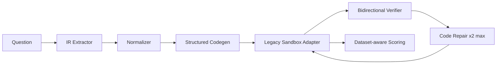

# SymPlanner IR Benchmark Plan

## Objective

Compare the old `SymPlanner` with one IR pipeline using the same legacy `Qwen/Qwen2.5-Coder-7B-Instruct`, dataset order, decoding settings and sandbox.

## Experiment matrix

| Method | Structured IR | Normalization | Bidirectional verify | Code repair |
|---|---:|---:|---:|---:|
| SymPlanner | No | No | Legacy verifier | Legacy repair |
| IR | Yes | Yes | Yes | Yes, tối đa 2 |

IR diagnostics and output-contract validation remain enabled. Small schema omissions are normalized; only an unusable target or relation graph is marked `invalid_ir`.

## Evaluation phases

1. Smoke: 3–5 GSM8K and 3–5 Math500 samples; confirm VRAM, context length, JSON compliance and checkpoint resume.
2. Pilot: the same 50 paired samples for both methods; inspect stage failures before interpreting accuracy.
3. Full: complete dataset or a pre-registered subset; no prompt/config changes during the run.

## Fixed controls

- Model: `Qwen/Qwen2.5-Coder-7B-Instruct`.
- Temperature: `0.0`.
- Seed: `42`.
- Input context: `6144` tokens.
- Identical dataset ordering, filters, sandbox timeout and retry budgets.
- Ground truth is used only by the final scorer, never by extractor, verifier or repair.

## Reported metrics

- Exact/equivalent-match accuracy and paired per-problem outcomes.
- Generated tokens by stage and total latency.
- Invalid-IR, execution-success and verification-pass rates.
- Repair recovery rate and average attempts.
- Breakdown by subject and difficulty using the legacy result schema.

## Math500 scope

Supported outputs include finite numeric values, exact fractions, symbolic expressions, tuples, finite sets, intervals, matrices and short categorical text. `answer` is dataset-facing; `canonical_answer` is verifier-facing. Matrix and infinity normalization extend the legacy scorer while retaining it as the first comparison layer.

## Readiness gate

Do not start the 50-sample pilot until all regression tests pass and the smoke phase produces one valid checkpoint for every method. No real model inference has been run as part of this implementation.
